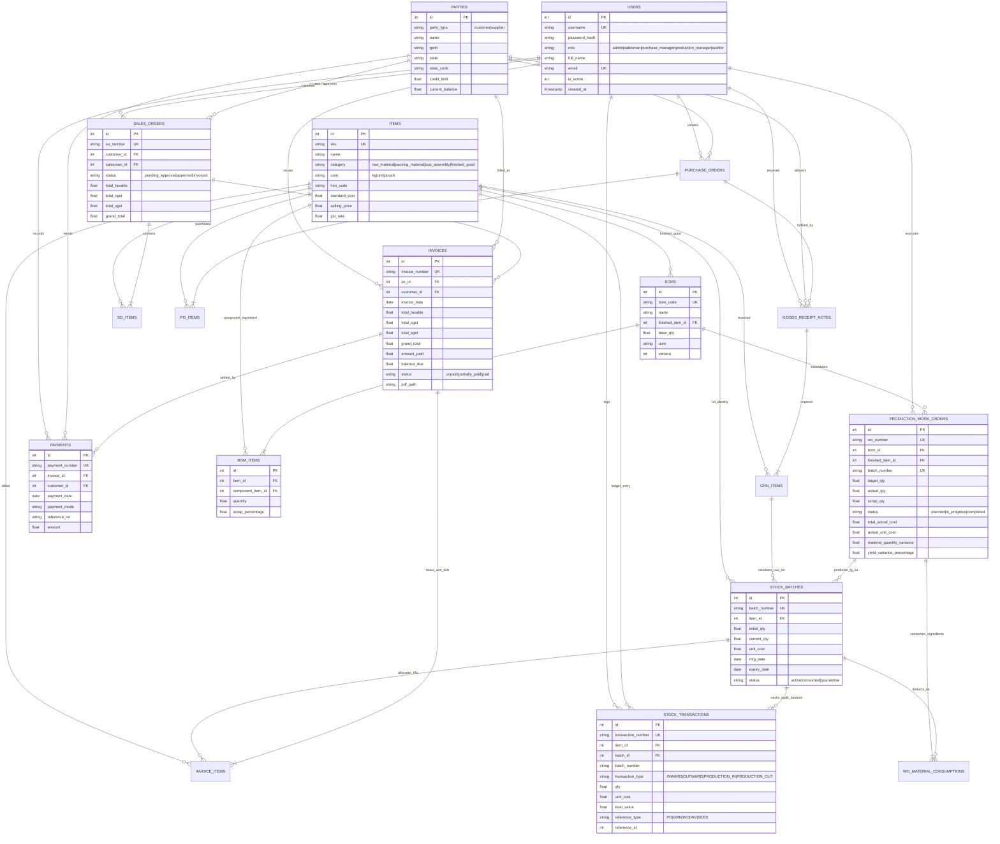

# BatchWise ERP - Entity Relationship (ER) Diagram

```mermaid
erDiagram
    USERS ||--o{ SALES_ORDERS : "creates / approves"
    USERS ||--o{ PURCHASE_ORDERS : "creates"
    USERS ||--o{ PRODUCTION_WORK_ORDERS : "executes"
    USERS ||--o{ GOODS_RECEIPT_NOTES : "receives"
    USERS ||--o{ INVOICES : "issues"
    USERS ||--o{ PAYMENTS : "records"
    USERS ||--o{ STOCK_TRANSACTIONS : "logs"

    PARTIES ||--o{ SALES_ORDERS : "customer"
    PARTIES ||--o{ INVOICES : "billed_to"
    PARTIES ||--o{ PAYMENTS : "remits"
    PARTIES ||--o{ PURCHASE_ORDERS : "supplier"
    PARTIES ||--o{ GOODS_RECEIPT_NOTES : "delivers"

    ITEMS ||--o{ BOMS : "finished_good"
    ITEMS ||--o{ BOM_ITEMS : "component_ingredient"
    ITEMS ||--o{ SO_ITEMS : "ordered"
    ITEMS ||--o{ PO_ITEMS : "purchased"
    ITEMS ||--o{ GRN_ITEMS : "received"
    ITEMS ||--o{ STOCK_BATCHES : "lot_identity"
    ITEMS ||--o{ STOCK_TRANSACTIONS : "ledger_entry"
    ITEMS ||--o{ INVOICE_ITEMS : "billed"

    BOMS ||--|{ BOM_ITEMS : "specifies_recipe"
    BOMS ||--o{ PRODUCTION_WORK_ORDERS : "instantiates"

    PURCHASE_ORDERS ||--|{ PO_ITEMS : "contains"
    PURCHASE_ORDERS ||--o{ GOODS_RECEIPT_NOTES : "fulfilled_by"

    GOODS_RECEIPT_NOTES ||--|{ GRN_ITEMS : "inspects"
    GRN_ITEMS ||--o{ STOCK_BATCHES : "initializes_raw_lot"

    PRODUCTION_WORK_ORDERS ||--|{ WO_MATERIAL_CONSUMPTIONS : "consumes_ingredients"
    PRODUCTION_WORK_ORDERS ||--o{ STOCK_BATCHES : "produces_fg_lot"

    STOCK_BATCHES ||--o{ STOCK_TRANSACTIONS : "tracks_audit_balance"
    STOCK_BATCHES ||--o{ WO_MATERIAL_CONSUMPTIONS : "deducts_lot"
    STOCK_BATCHES ||--o{ INVOICE_ITEMS : "allocates_fifo"

    SALES_ORDERS ||--|{ SO_ITEMS : "contains"
    SALES_ORDERS ||--o{ INVOICES : "converts_to"

    INVOICES ||--|{ INVOICE_ITEMS : "taxes_and_bills"
    INVOICES ||--o{ PAYMENTS : "settled_by"

    USERS {
        int id PK
        string username UK
        string password_hash
        string role "admin|salesman|purchase_manager|production_manager|auditor"
        string full_name
        string email UK
        int is_active
        timestamp created_at
    }

    PARTIES {
        int id PK
        string party_type "customer|supplier"
        string name
        string gstin
        string state
        string state_code
        float credit_limit
        float current_balance
    }

    ITEMS {
        int id PK
        string sku UK
        string name
        string category "raw_material|packing_material|sub_assembly|finished_good"
        string uom "kg|unit|pouch"
        string hsn_code
        float standard_cost
        float selling_price
        float gst_rate
    }

    BOMS {
        int id PK
        string bom_code UK
        string name
        int finished_item_id FK
        float base_qty
        string uom
        int version
    }

    BOM_ITEMS {
        int id PK
        int bom_id FK
        int component_item_id FK
        float quantity
        float scrap_percentage
    }

    STOCK_BATCHES {
        int id PK
        string batch_number UK
        int item_id FK
        float initial_qty
        float current_qty
        float unit_cost
        date mfg_date
        date expiry_date
        string status "active|consumed|quarantine"
    }

    STOCK_TRANSACTIONS {
        int id PK
        string transaction_number UK
        int item_id FK
        int batch_id FK
        string batch_number
        string transaction_type "INWARD|OUTWARD|PRODUCTION_IN|PRODUCTION_OUT"
        float qty
        float unit_cost
        float total_value
        string reference_type "PO|GRN|WO|INV|SEED"
        int reference_id
    }

    PRODUCTION_WORK_ORDERS {
        int id PK
        string wo_number UK
        int bom_id FK
        int finished_item_id FK
        string batch_number UK
        float target_qty
        float actual_qty
        float scrap_qty
        string status "planned|in_progress|completed"
        float total_actual_cost
        float actual_unit_cost
        float material_quantity_variance
        float yield_variance_percentage
    }

    SALES_ORDERS {
        int id PK
        string so_number UK
        int customer_id FK
        int salesman_id FK
        string status "pending_approval|approved|invoiced"
        float total_taxable
        float total_cgst
        float total_sgst
        float grand_total
    }

    INVOICES {
        int id PK
        string invoice_number UK
        int so_id FK
        int customer_id FK
        date invoice_date
        float total_taxable
        float total_cgst
        float total_sgst
        float grand_total
        float amount_paid
        float balance_due
        string status "unpaid|partially_paid|paid"
        string pdf_path
    }

    PAYMENTS {
        int id PK
        string payment_number UK
        int invoice_id FK
        int customer_id FK
        date payment_date
        string payment_mode
        string reference_no
        float amount
    }
```
